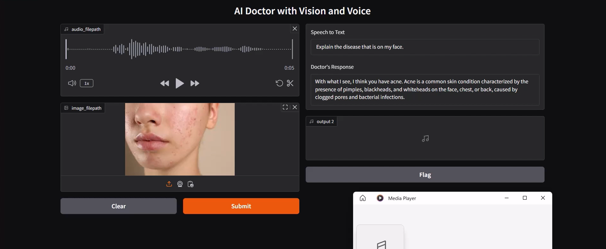
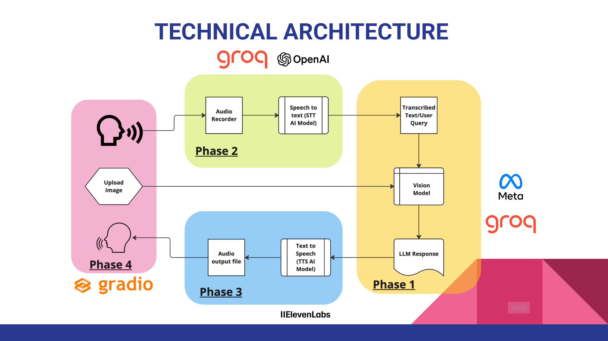

# MediDas2.0 - AI-Powered Medical Assistant 🏥


## 🚀 Overview
**MediDas2.0** is a multimodal AI-powered medical assistant designed to revolutionize diagnostics and consultations. By integrating state-of-the-art AI models, MediDas2.0 enables:

- **Medical Image Processing** 📸
- **Speech-to-Text Transcription** 🎙️➡️📜
- **Natural Voice Response Generation** 🩺🔊
- **Seamless Doctor-Patient Interaction** 🏥🗣️

This project bridges the gap between AI and healthcare, ensuring accurate, efficient, and accessible medical consultations.

---

## 🏗️ Project Phases
### **🔬 Phase 1: Setup the Brain of the Doctor (Multimodal LLM)**
- Configure **GROQ API** for AI model inference.
- Convert **medical images** into a suitable format for analysis.
- Deploy a **Multimodal Large Language Model (LLM)** to process and interpret medical data.

### **🎤 Phase 2: Setup the Voice of the Patient**
- Implement an **audio recorder/player** to capture patient speech.
- Deploy a **Speech-to-Text (STT) model** for real-time medical transcription.

### **🩺 Phase 3: Setup the Voice of the Doctor**
- Utilize **gTTS & ElevenLabs** for **Text-to-Speech (TTS)**.
- Convert AI-generated medical advice into a **natural-sounding voice**.

### **🖥️ Phase 4: Setup UI for the VoiceBot**
- Develop an interactive **Gradio-based UI** for a seamless user experience.

---

## 🛠️ Tech Stack
| Category        | Technology |
|---------------|------------|
| **AI Models** | Multimodal LLM, STT, TTS (gTTS, ElevenLabs) |
| **APIs**      | GROQ API |
| **Frameworks** | Python, Gradio |
| **Tools**      | OpenCV, NumPy, Pandas |

---

## 📥 Installation & Usage Guide
### **Prerequisites**
- Python 3.8+
- API Keys for GROQ, ElevenLabs
- Virtual Environment (recommended)

### **Installation Steps**
```bash
# Clone the repository
git clone https://github.com/your-username/MediDas2.0.git
cd MediDas2.0

# Create and activate a virtual environment
python -m venv venv
source venv/bin/activate  # On Windows use `venv\Scripts\activate`

# Install dependencies
pip install -r requirements.txt
```

### **Configuration & Execution**
1. **Set API Keys** in `.env` file:
```env
GROQ_API_KEY=your_api_key
ELEVENLABS_API_KEY=your_api_key
```
2. **Run the VoiceBot**:
```bash
python app.py
```
3. **Access the UI** via `http://localhost:7860`

---

### **User Interface**


### **System Architecture**


---

## 🤝 Contributing
We welcome contributions! Follow these steps:
1. **Fork** the repository.
2. **Create a feature branch** (`git checkout -b feature-name`).
3. **Commit changes** (`git commit -m "Added new feature"`).
4. **Push to GitHub** (`git push origin feature-name`).
5. **Submit a PR** for review.

---

## 🔮 Future Enhancements
- **🔍 Real-time diagnostics with ML**
- **📁 EHR (Electronic Health Record) integration**
- **📊 AI-driven patient risk assessment**
- **🤖 Conversational AI improvements**

---

## 📜 License
This project is licensed under the **MIT License**.

---

## 📩 Contact & Support
For queries and collaborations:
📧 Email: [contact@medidas2.ai](mailto:aicinema69@gmail.com)
🌐 Website: N/A


